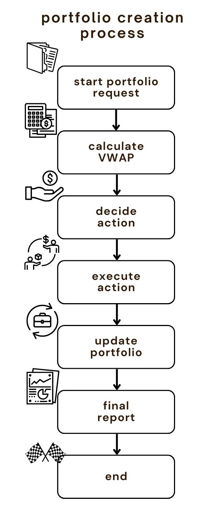

# **Trading Algorithm Project**

## Overview

_A Data-Driven Approach to Buy, Sell, and Manage Risk in Trading_

This project implements a dynamic trading algorithm that uses Volume Weighted Average Price (VWAP) to decide actions such as buy, sell, cancel, or hold shares. The algorithm seeks to make profitable trades by leveraging market data and executing orders based on calculated VWAP.

## Table of Contents
1. [Technology Used](#technology-used)
2. [Prerequisites](#prerequisites)
3. [Strategy Highlights](#strategy-highlights)
4. [Project Flowchart](#project-flowchart)
5. [How the Algorithm Works](#how-the-algorithm-works)
6. [Algorithm Performance](#algorithm-performance)
7. [Backtesting Infrastructure](#backtesting-infrastructure)
8. [FAQ](#frequently-asked-questions)
9. [Installation](#installation)
10. [Testing](#testing)

# Technology Used

	•	Java
	•	Maven (for build and dependency management)
	•	JUnit (for testing)

# Prerequisites

Before you begin, make sure you have the following installed:

	•	JDK 17 or higher
	•	Apache Maven 3.6 or newer

# Strategy Highlights

	•	BUY when the current price is below VWAP and there are fewer than a specified number of active buy orders.
	•	SELL when the price is above VWAP and there are active buy orders.
	•	CANCEL when market conditions (VWAP) suggest extreme behavior to minimise risk.
	•	HOLD when none of the above conditions are met.

# Project Flowchart

The flowchart below illustrates the process of the trading algorithm, from portfolio initialisation to decision-making and execution of trades. Each step corresponds to the logic implemented in the algorithm to determine how to interact with the market.

# How the Algorithm Works

	1.	Start Portfolio: Initialise the trading portfolio, defining key metrics like initial shares owned, total spent, total earned, and profit.
	2.	Calculate VWAP: Compute VWAP based on bid and ask levels in the market. This represents the average price weighted by volume to help make buy/sell decisions.
	3.	Decide Action: Evaluate market conditions (price, VWAP, order limits) to decide whether to:
	•	Buy: Price < VWAP and fewer than the desired number of active buy orders.
	•	Sell: Price > VWAP and there are active buy orders.
	•	Cancel: VWAP is too high/low, triggering the cancellation of orders.
	•	Hold: None of the above conditions are met.
	4.	Execute Action: Based on the decision, execute a trade or take no action (hold).
	5.	Update Portfolio: Modify portfolio statistics such as total shares, total spent, and total earned.
	6.	Final Report: Calculate profit and return on investment (ROI) at the end of the algorithm’s execution.

# Algorithm Performance

At the end of the algorithm’s execution, the following final report is generated:

`[FINAL STATE REPORT 🏦] Shares Owned: 200 | Total Spent: 305,000 | Total Earned: 320,000 | Estimated Profit: 29,000.0
ROI 💰: 4.92% | Estimated ROI 📈: 9.51%`

	•	Profit: The realised profit from sold shares is 29,000, based on the difference between total spent and total earned.
	•	Estimated Profit: The estimated profit of 29,000 includes both sold shares and the market value of the shares still owned (200 shares).
	•	ROI: The Return on Investment (ROI) is 4.92%, which shows a positive return from the total spent.
	•	Estimated ROI: The estimated ROI (including the unsold shares) is 9.51%, reflecting the potential value if the remaining shares were sold at the current market price.

These results demonstrate that the algorithm is capable of making a profit while managing risk through its VWAP-based strategy.

# Backtesting Infrastructure

To ensure the algorithm performs well across various market conditions, I created simulated market data ticks to adjust bid/ask prices and test VWAP reactions. These simulations trigger the following actions:

	•	CreateTickBuy1 simulates buy actions when prices fall below the VWAP.
	•	CreateTickSell1 simulates sell actions when prices rise above VWAP.
	•	CreateTickCancel1 triggers a cancel action when VWAP drops too low or goes too high.

These market ticks test the algorithm’s decision-making process and ensure the logic behaves as expected under different market scenarios.

# Key Parts of the Project

**1. VWAP Calculation**

VWAP is calculated using the formula:
VWAP = (Sum of (Price * Quantity) for all orders) / (Sum of Quantity for all orders)

The algorithm uses the top three bid and ask levels to approximate the VWAP since no historical trade data is provided. If there are no active orders, a default VWAP is used to maintain decision-making consistency.

**2. Risk Management**

   •	Limit on total orders ensures that overexposure is avoided.
   •	Cancelling orders helps manage risk when VWAP reaches extreme values.
   •	The algorithm cancels the oldest active order to prevent holding onto poor positions.

**3. Portfolio Updates**

For each buy or sell action, the algorithm tracks:

	•	Shares Owned
	•	Total Spent
	•	Total Earned
	•	Profit (Realised and Estimated)

This allows the algorithm to measure the profitability of trades and track portfolio performance over time.

# Frequently Asked Questions (FAQ)

**1. How does the algorithm decide when to buy or sell?**
   
The algorithm buys shares when the price is below VWAP and sells when the price exceeds VWAP. These actions are limited by the number of active orders allowed to prevent overexposure.

**2. What happens if the market conditions become too extreme?**
   
If VWAP falls below or exceeds a defined range, the algorithm cancels the oldest active order to prevent holding onto risky positions.

**3. How is the VWAP calculated without historical trade data?**
   
The algorithm approximates VWAP using the top three bid and ask levels in the market, providing a balance between capturing market liquidity and available data.

**4. What kind of market data was used for testing?**
   
Simulated market data ticks were created to test the algorithm’s behavior. Each tick adjusts bid/ask prices to trigger buy, sell, or cancel actions.

**5. How does the algorithm track profitability?**
   
The algorithm calculates both realised profit (from sold shares) and estimated profit (from current shares’ market value), giving insight into the overall portfolio performance.

# Running the application:
1.	Clone the repository:
      `git clone git@github.com:Nyadej/trading-algorithm-assessment.git
      `
2. Navigate to the project directory:
   `   cd trading-algorithm-assessment
   `
3. Build the project with Maven:
   `   mvn clean install
   `

# Testing
You can run the tests with the following Maven command:
`mvn test`

